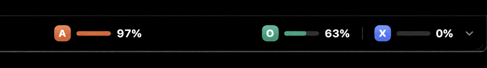

# NotchFuel

Your AI runway, in the notch. NotchFuel is a small native macOS app that shows how much AI usage is used or remaining beside the MacBook camera cutout for:



- Anthropic / Claude Code
- OpenAI / Codex
- Grok CLI

The idle island hugs the top-center camera notch. Move the pointer onto it and it smoothly expands downward to reveal segmented fuel gauges for each usage window; move away and it collapses after a short delay. It reuses the sessions maintained by the official command-line tools. Credentials are read-only, stay on the Mac, and are never logged or copied into NotchFuel storage.

Use the bell menu in the expanded island to choose a used-usage alert threshold from 50% to 95%, including 85%, or turn alerts off. NotchFuel uses standard macOS notifications and alerts once per provider usage window and reset cycle.

NotchFuel checks the signed GitHub Releases appcast daily. Sparkle verifies the signed feed and update package, downloads new versions in the background, and installs them automatically when macOS permits. The download button in the island starts a manual update check.

## Requirements

- Apple-silicon Mac
- macOS 14 or newer
- At least one supported CLI installed and signed in

## Build and test

```sh
swift test
./scripts/build-release.sh
```

The release script produces:

- `build/NotchFuel.app`
- `release/NotchFuel-1.4.0-arm64.dmg`

The local build is ad-hoc signed. A public internet release should be signed with an Apple Developer ID and notarized.

## Publishing an update

Sparkle 2.9.6 is included through Swift Package Manager. Its EdDSA private key stays in the developer's login Keychain; only the public key is committed in `Packaging/Info.plist`. Run `scripts/publish-release.sh` to build the DMG, sign the update and appcast, publish the GitHub Release, and push the updated `appcast.xml`.

## Privacy

NotchFuel makes read-only HTTPS usage requests to the same provider services used by the installed CLIs. It has no analytics, account system, or background server. Anthropic credentials are read from macOS Keychain; Codex and Grok credentials are read from their local auth files. NotchFuel does not refresh or modify any provider credential.

## Acknowledgement

The provider endpoint and response-shape research was informed by Jaco Veldsman's MIT-licensed [usage-monitor](https://github.com/jackfieldman/usage-monitor). See `THIRD_PARTY_NOTICES.md`.
